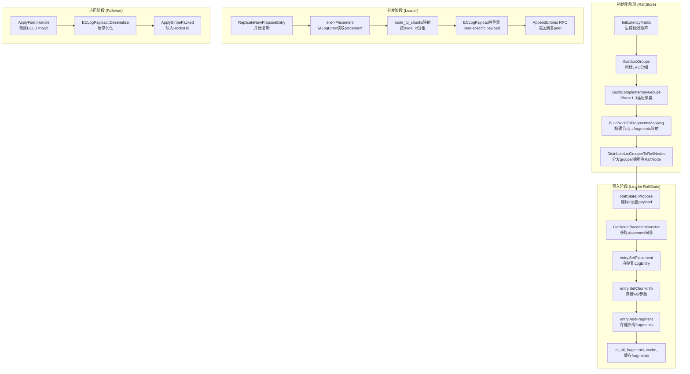

# LRC 放置约束修复方案

## 一、Placement 计算与获取的对应关系验证

### 完整数据流（已确认正确）



### 对应关系确认

| 计算位置 | 存储位置 | 读取位置 | 状态 |
|----------|----------|----------|------|
| `BuildComplementaryGroups()` | `groups_` 成员变量 | `GetGroups()` | ✓ 对应 |
| `BuildNodeToFragmentsMapping()` | `node_to_frags_` 成员变量 | `GetFragmentsForNode()` | ✓ 对应 |
| `GetNodePlacementsVector()` | 无存储，每次重新计算 | `raft_store.h:1165`, `raft.cc:553` | ✓ 对应 |
| `entry.SetPlacement()` | `LogEntry.placement_` | `ent->Placement()` | ✓ 对应 |

**结论：placement 计算和读取链路完整正确，但存在约束违反问题（数据块和局部校验块可能在同一节点）。**

---

## 二、问题根因

当前 `LrcComplementaryGrouper` 中存在**两处**相同的数据块分配逻辑，均使用 `group_nodes[i % group_size]` 导致数据块可能分配到 `group_nodes.back()`（局部校验节点），违反约束。

### 问题代码位置

**1. `BuildNodeToFragmentsMapping()` 第562行**：
```cpp
int node_id = group_nodes[i % group_size];  // 可能等于 group_nodes.back()
```

**2. `GetNodePlacementsVector()` 第209行**：
```cpp
fp.node_id = group_nodes[i % group_size];   // 可能等于 group_nodes.back()
```

### 数学证明

每个局部组的节点数：
```
group_size = local_k + 1 + ceil(r/l)
           > local_k + 1
           >= local_k + 2  (因为均为整数)
```

因此修改后 `local_k <= group_size - 2` 恒成立，`local_k <= group_size - 1` 更宽松，始终可满足。

---

## 修复步骤

### 步骤 1：修复 `BuildNodeToFragmentsMapping()` 中的数据块分配

**文件**: `multi-raft/lrc_complementary_grouper.h`

**修改位置**: 第556-567行

**旧代码**:
```cpp
// ========== Step 1: 分配数据块 [0, k) ==========
int frag_id = 0;
for (int g = 0; g < l; ++g) {
  const auto& group_nodes = groups_[g].member_nodes;
  int group_size = static_cast<int>(group_nodes.size());
  for (int i = 0; i < local_k && frag_id < k; ++i) {
    int node_id = group_nodes[i % group_size];  // 问题：可能等于 parity node
    node_to_frags_[node_id].push_back(frag_id);
    ++frag_id;
  }
}
```

**新代码**:
```cpp
// ========== Step 1: 分配数据块 [0, k) ==========
// 规则：数据块分配到组内前 (group_size-1) 个节点
//       局部校验块分配到组内最后一个节点
//       确保数据块和局部校验块不在同一节点
int frag_id = 0;
for (int g = 0; g < l; ++g) {
  const auto& group_nodes = groups_[g].member_nodes;
  int group_size = static_cast<int>(group_nodes.size());
  // 数据块只分配到前 (group_size-1) 个节点，跳过最后节点（parity 节点）
  for (int i = 0; i < local_k && frag_id < k; ++i) {
    int node_id = group_nodes[i % (group_size - 1)];
    node_to_frags_[node_id].push_back(frag_id);
    ++frag_id;
  }
}
```

---

### 步骤 2：修复 `GetNodePlacementsVector()` 中的数据块分配

**文件**: `multi-raft/lrc_complementary_grouper.h`

**修改位置**: 第199-213行

**旧代码**:
```cpp
// Phase 1: 数据块 (frag_id = 0 ~ k-1)
for (int g = 0; g < l; ++g) {
  const auto& group_nodes = groups_[g].member_nodes;
  int group_size = static_cast<int>(group_nodes.size());
  for (int i = 0; i < local_k; ++i) {
    int frag_id = g * local_k + i;
    FragmentPlacement fp;
    fp.frag_id = frag_id;
    fp.local_group = g;
    fp.node_id = group_nodes[i % group_size];  // 问题：可能等于 parity node
    fp.kind = FragmentPlacement::Kind::kData;
    placements.push_back(fp);
  }
}
```

**新代码**:
```cpp
// Phase 1: 数据块 (frag_id = 0 ~ k-1)
// 规则：数据块分配到组内前 (group_size-1) 个节点，跳过最后节点（parity 节点）
for (int g = 0; g < l; ++g) {
  const auto& group_nodes = groups_[g].member_nodes;
  int group_size = static_cast<int>(group_nodes.size());
  for (int i = 0; i < local_k; ++i) {
    int frag_id = g * local_k + i;
    FragmentPlacement fp;
    fp.frag_id = frag_id;
    fp.local_group = g;
    fp.node_id = group_nodes[i % (group_size - 1)];  // 修复：跳过 parity 节点
    fp.kind = FragmentPlacement::Kind::kData;
    placements.push_back(fp);
  }
}
```

---

### 步骤 3：添加约束验证函数

在 `VerifyGroups()` 后添加 `ValidatePlacementConstraints()` 函数，用于验证放置约束是否满足。

**文件**: `multi-raft/lrc_complementary_grouper.h`

在 `VerifyGroups()` 函数（第634-673行）后添加：

```cpp
// =========================================================================
//  ValidatePlacementConstraints: 验证 LRC 放置约束
// =========================================================================
bool ValidatePlacementConstraints() const {
  printf("\n[LRC-COMPL-GROUP] ===== Validating Placement Constraints =====\n");

  int k = lrc_params_.k;
  int l = lrc_params_.l;
  int local_k = lrc_params_.local_k();
  bool all_ok = true;

  // 约束1：每节点恰好 2 个 fragment
  for (int n = 0; n < N_; ++n) {
    int frag_count = static_cast<int>(node_to_frags_[n].size());
    if (frag_count != 2) {
      printf("[LRC-VALIDATE] ERROR: Node %d has %d fragments (expected 2)\n", n, frag_count);
      all_ok = false;
    }
  }

  // 约束2：数据块和局部校验块不在同一节点
  for (int g = 0; g < l; ++g) {
    const auto& group_nodes = groups_[g].member_nodes;
    int parity_node = group_nodes.back();

    // 找出该组数据块的分配节点
    for (int i = 0; i < local_k; ++i) {
      int frag_id = g * local_k + i;
      for (int n = 0; n < N_; ++n) {
        for (int fid : node_to_frags_[n]) {
          if (fid == frag_id) {
            if (n == parity_node) {
              printf("[LRC-VALIDATE] ERROR: Data frag %d and local parity %d both on node %d\n",
                     frag_id, k + g, n);
              all_ok = false;
            }
            break;
          }
        }
      }
    }
  }

  // 约束3：组内节点数 >= local_k + 1
  for (int g = 0; g < l; ++g) {
    int group_size = static_cast<int>(groups_[g].member_nodes.size());
    if (group_size < local_k + 1) {
      printf("[LRC-VALIDATE] ERROR: Group %d has %d nodes, need at least %d\n",
             g, group_size, local_k + 1);
      all_ok = false;
    }
  }

  if (all_ok) {
    printf("[LRC-VALIDATE] All constraints satisfied!\n");
  }

  printf("[LRC-COMPL-GROUP] ===== Validation Complete =====\n\n");
  return all_ok;
}
```

在 `VerifyGroups()` 函数末尾添加调用：
```cpp
// 在 VerifyGroups() 末尾 "Verification complete" printf 之后添加
ValidatePlacementConstraints();
```

---

### 步骤 4：验证约束的数学保证

修改后的分配保证：

| 约束 | 验证 |
|------|------|
| 数据块和局部校验块不在同一节点 | 数据块分配到 `[0, group_size-1)`，局部校验分配到 `group_size-1` |
| 每节点恰好 2 个 fragment | 每组空槽数 = `group_size - local_k - 1`；总空槽 = `N - k - l = r`；恰好容纳全局校验 |
| 组内延迟低 | Phase1/2/3 延迟感知分组算法不变 |
| 组大小接近 | VerifyGroups() 检查 max-min <= 1 不变 |

---

## 冗余代码清理

### 完全冗余（可删除）

| 文件 | 理由 |
|------|------|
| `test_lrc_group.cc` | 与 `multi-raft/test/test_lrc_group.cc` 内容重复 |
| `test_lrc_params.cc` | 与 `multi-raft/test/test_lrc_params.cc` 内容重复 |
| `test_encoding_compare.cc` | 独立测试，未被引用 |
| `test_lrc_encode_pipeline.cc` | 独立测试，未被引用 |

### 部分冗余（标记废弃）

| 文件/组件 | 状态 | 理由 |
|-----------|------|------|
| `multi-raft/lrc_group_builder.h` | 废弃 | 仅被测试引用，生产路径使用 `LrcComplementaryGrouper` |
| `multi-raft/lrc_placement.h` (OrthogonalPlacer) | 废弃 | LRC 模式使用 `LrcComplementaryGrouper`，RS_3F 模式保留 `RsRandomPlacement` |

### 保留的代码

| 文件 | 保留原因 |
|------|----------|
| `multi-raft/lrc_encoder.h` | LRC 编码核心 |
| `multi-raft/lrc_complementary_grouper.h` | 放置算法核心 |
| `multi-raft/latency_matrix.h` | 延迟矩阵 |
| `multi-raft/ec_payload.h` | payload 序列化 |
| `multi-raft/stripe_apply.cc` | RocksDB 写入 |

---

## 测试验证

修改后运行以下测试：

1. **参数测试**: `multi-raft/test/test_lrc_params.cc`
2. **分组测试**: `multi-raft/test/test_lrc_group.cc`
3. **集成测试**: YCSB 多 Raft 测试

验证日志输出：
```
[LRC-VALIDATE] All constraints satisfied!
每节点恰好 2 个 fragment ✓
数据块和局部校验块不在同一节点 ✓
```

---

## 修复总结

| 任务 | 优先级 | 风险 |
|------|--------|------|
| 修复 BuildNodeToFragmentsMapping() | 高 | 低 |
| 修复 GetNodePlacementsVector() | 高 | 低 |
| 添加 ValidatePlacementConstraints() | 中 | 低 |
| 删除根目录冗余测试文件 | 低 | 低 |
| 标记 lrc_group_builder.h 为废弃 | 低 | 低 |

**N=7, LRC(4,2,4), l=2, local_k=2**

假设分组结果：
- Group 0: nodes = {2, 5, 6} (size=3)
- Group 1: nodes = {0, 1, 3, 4} (size=4)

**修复前**（有冲突）：
```
Group 0: 数据 {2, 5, 6}  ← frag2 和 parity4 都在 node6！
Group 1: 数据 {0, 1, 3}  ← frag3 和 parity5 都在 node4？
```

**修复后**（无冲突）：
```
Group 0: 数据 frags 0,1 → nodes[0%2]=2, nodes[1%2]=5
         局部校验 frag4 → nodes[2]=6 (不在数据节点)
Group 1: 数据 frags 2,3 → nodes[0%3]=0, nodes[1%3]=1
         局部校验 frag5 → nodes[3]=4 (不在数据节点)
全局校验 frags 6,7,8,9 → 填充到空槽 (每节点恰好2个)
```

---

## 测试验证

修改后运行以下测试确保正确性：

1. **单元测试**: `multi-raft/test/test_lrc_group.cc`
2. **参数测试**: `multi-raft/test/test_lrc_params.cc`
3. **手动验证**: 观察日志输出确认约束满足

验证条件：
```
每节点恰好 2 个 fragment ✓
数据块和局部校验块不在同一节点 ✓
所有全局校验块均匀分布 ✓
```
