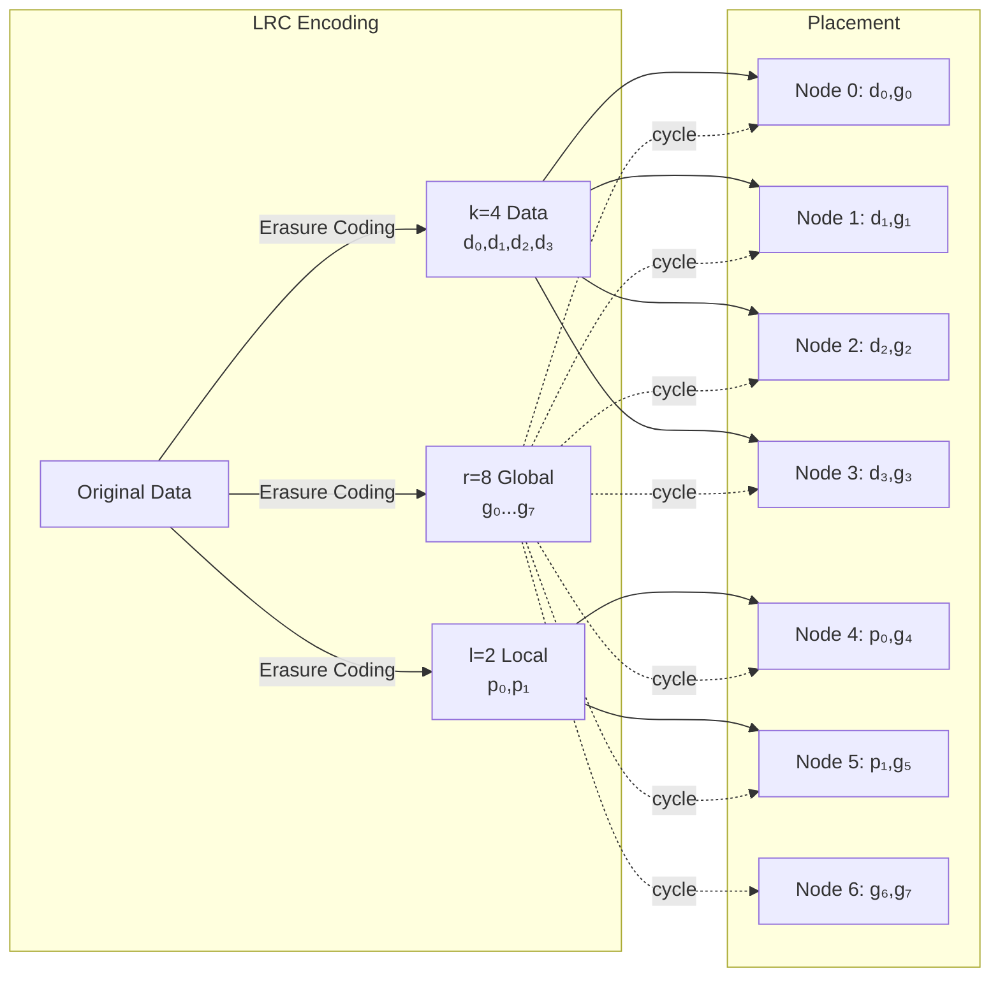
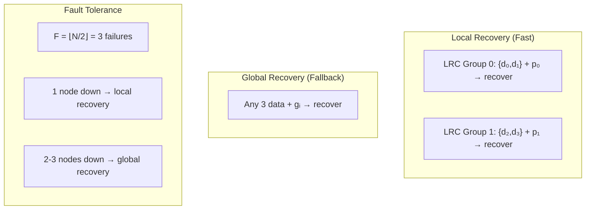

# LRC Encoding and Placement Diagram

**For paper figures, use the Mermaid diagrams in `lrc_placement_diagram.md` or the ASCII diagrams in `lrc_diagram_for_paper.md`.**

## Quick Reference

```
LRC Parameters (N=7):
  k = ⌊N/2⌋ + 1 = 4  (data fragments)
  l = 2                (local groups)
  r = 2N - k - l = 8  (global parity fragments)
  total = k + l + r = 14 = 2N  (2 frags per node)

Frag ID Convention:
  [0, k)       = [0,4)   → Data:     d₀, d₁, d₂, d₃
  [k, k+l)     = [4,6)   → Local:    p₀, p₁
  [k+l, k+l+r) = [6,14)  → Global:   g₀ ... g₇

Node Placement:
  Node 0: [0] d₀,  [6] g₀
  Node 1: [1] d₁,  [7] g₁
  Node 2: [2] d₂,  [8] g₂
  Node 3: [3] d₃,  [9] g₃
  Node 4: [4] p₀,  [10] g₄
  Node 5: [5] p₁,  [11] g₅
  Node 6: [12] g₆, [13] g₇
```

## Mermaid Diagram Source

### Encoding Overview



### Recovery Paths


