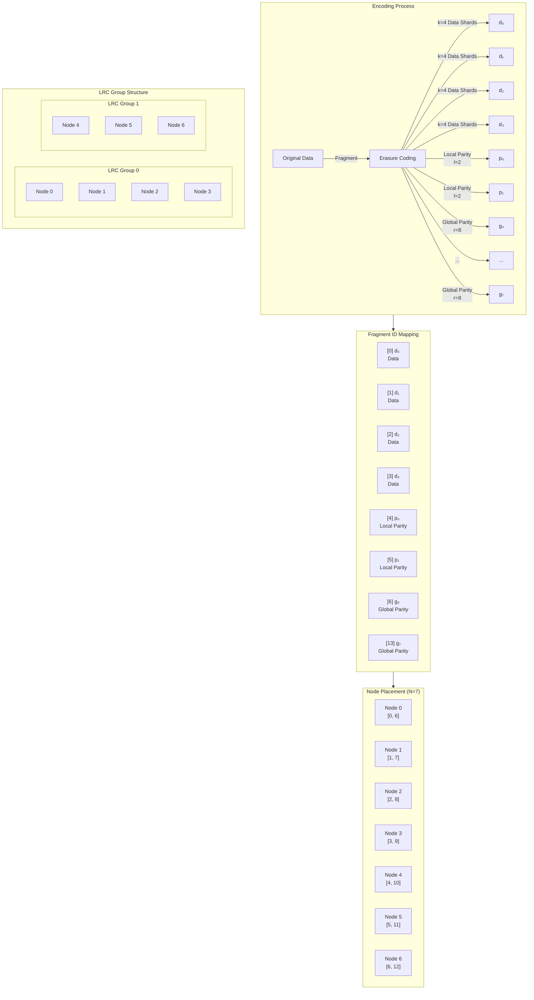
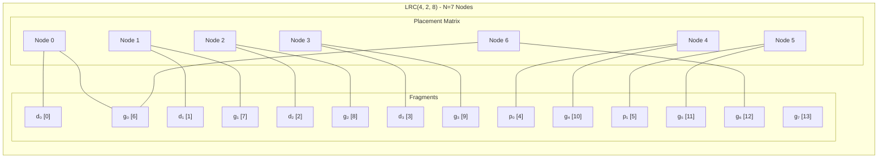
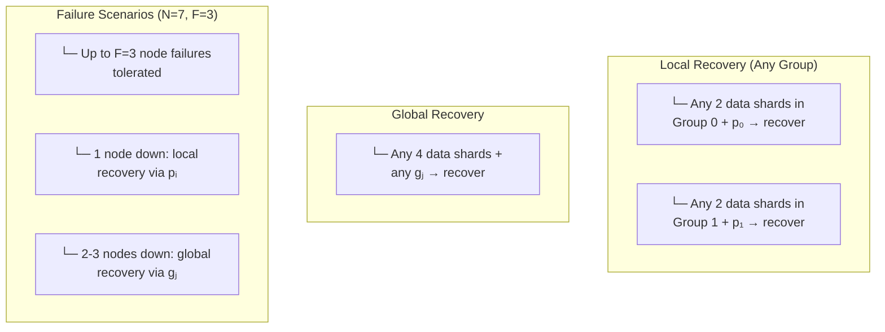
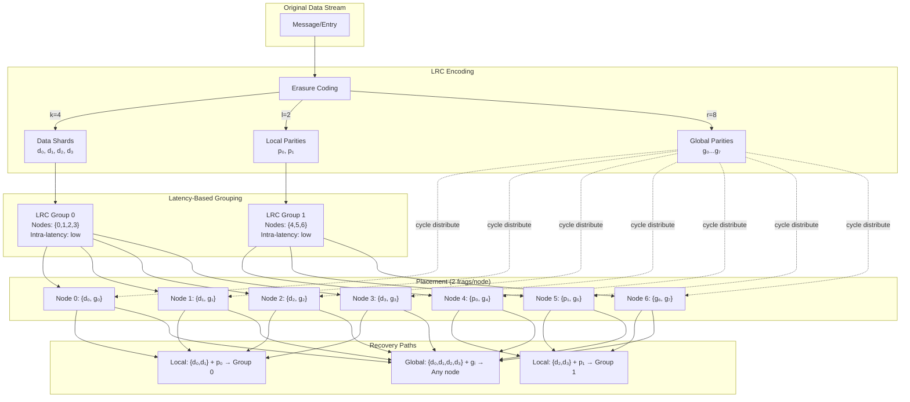

# LRC Encoding and Placement Diagram

## Architecture Overview



## Detailed Placement Table



## Frag ID Convention

```
┌─────────────────────────────────────────────────────────────────┐
│                    Fragment ID Convention                         │
├─────────────┬─────────────┬──────────────────────────────────────┤
│   Range     │    Type     │           Description               │
├─────────────┼─────────────┼──────────────────────────────────────┤
│  [0, k)     │   Data      │  k data fragments                  │
│             │             │  k = 4 for LRC(4,2,8)              │
├─────────────┼─────────────┼──────────────────────────────────────┤
│  [k, k+l)   │ Local Parity│  l local parity fragments           │
│             │             │  p₀ belongs to Group 0              │
│             │             │  p₁ belongs to Group 1              │
├─────────────┼─────────────┼──────────────────────────────────────┤
│ [k+l, k+l+r)│ Global Parity│ r global parity fragments          │
│             │             │  distributed evenly                  │
└─────────────┴─────────────┴──────────────────────────────────────┘
```

## Recovery Properties



## Complete System Diagram


